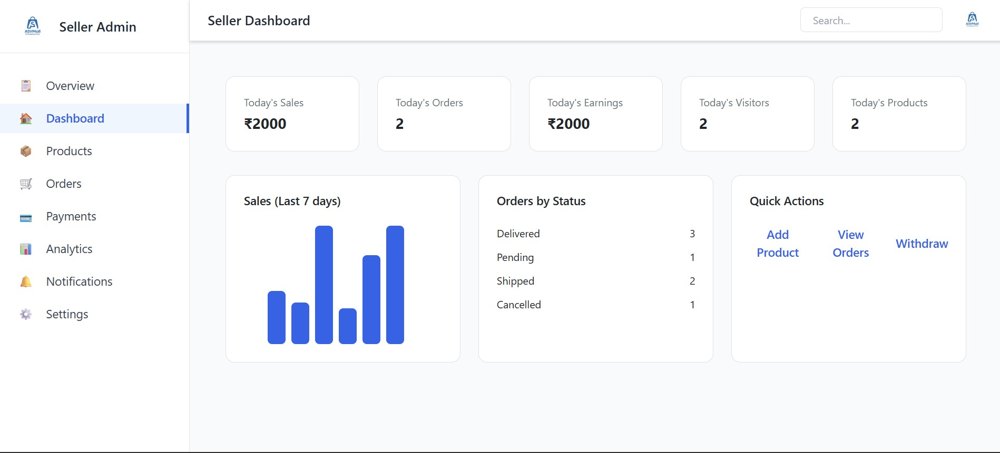
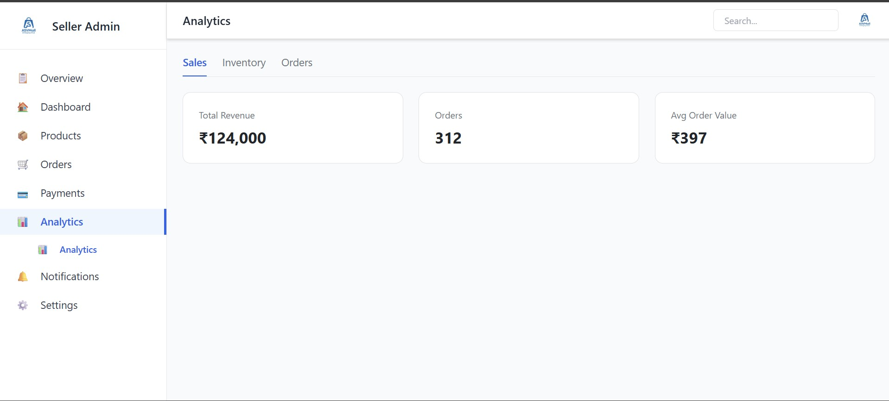
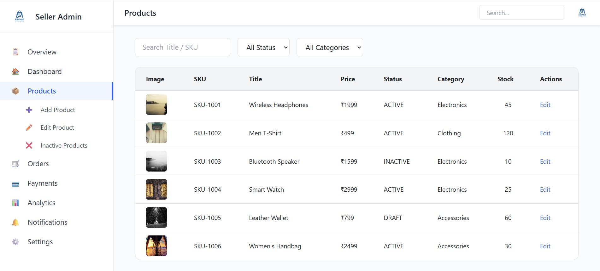
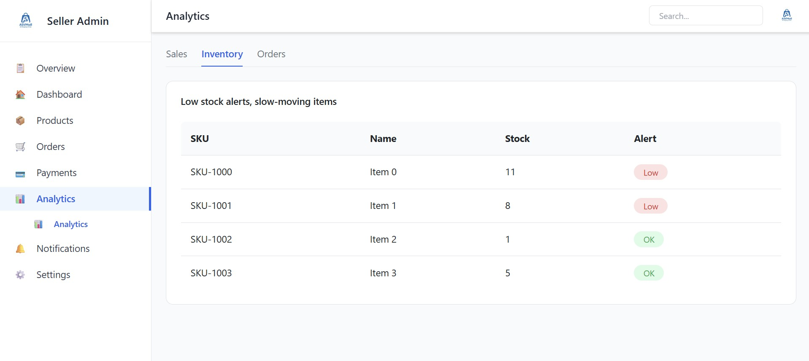

# ASV Mall Seller Dashboard

A full-stack seller management platform for managing products, orders, inventory, and analytics.

This project includes a **React frontend** and **Spring Boot backend** for managing an e-commerce seller dashboard.

---

## Features

* Seller Dashboard Overview
* Product Management (Add / Edit / View Products)
* Inventory Management
* Sales Analytics
* Order Tracking
* Image Upload API
* Category and SKU management

---

## Tech Stack

Frontend

* React
* Tailwind CSS
* React Router

Backend

* Spring Boot
* JPA / Hibernate
* MySQL

Other Tools

* Git
* GitHub
* Postman

---

## Project Structure

```
project-root
│
├── avsmall-app (React Frontend)
├── asvmallsellersv1apis (Spring Boot Backend)
├── screenshots
└── README.md
```

---

## Screenshots

### Seller Dashboard



### Analytics Page



### Product Management



### Inventory Page



---

## Running the Frontend

```
cd avsmall-app
npm install
npm start
```

Open:

http://localhost:3000

---

## Running the Backend

```
cd asvmallsellersv1apis
mvn spring-boot:run
```

Backend runs on:

```
http://localhost:9020
```

---

## Future Improvements

* Payment integration
* Order notifications
* Advanced analytics charts
* Seller reports
* Role based authentication

---

## Author

Taraka Ramarao

GitHub: https://github.com/
